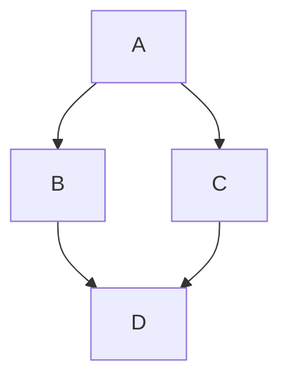

# Markdown 渲染特性测试文档

本文档用于测试目标 Markdown 渲染程序对多种语法特性的支持情况，包括标准语法、GitHub 风格扩展、自定义容器以及提示块。

---

## 1. 基础语法

### 标题层级

# H1

## H2

### H3

#### H4

##### H5

###### H6

### 段落与换行

这是第一段。  
这是第二段（行末加两个空格强制换行）。

这是第三段（空行分隔）。

### 强调

- _斜体_ 或 _斜体_
- **粗体** 或 **粗体**
- **_粗斜体_** 或 **_粗斜体_**
- ~~删除线~~

### 列表

无序列表：

- 项目 1
- 项目 2
  - 子项目 2.1
  - 子项目 2.2

有序列表：

1. 第一项
2. 第二项
   1. 子项 2.1
   2. 子项 2.2

### 链接与图片

[普通链接](https://example.com)  
[带标题的链接](https://example.com "示例网站")  
自动链接：<https://example.com>

图片（如果渲染器支持）：


### 引用

> 这是普通引用块。
> 可以跨行。
>
> > 嵌套引用。

### 代码

行内代码：`printf("Hello, world!");`

代码块（指定语言）：

```python
def hello():
    print("Hello, world!")
```

无语言代码块：

```
这是普通代码块
```

### 水平分割线

---

---

---

### 表格

| 左对齐  | 居中对齐 |  右对齐 |
| :------ | :------: | ------: |
| 单元格1 | 单元格2  | 单元格3 |
| 长内容  | 更多内容 |    更多 |

---

## 2. 扩展语法（GFM / CommonMark 扩展）

### 任务列表

- [x] 已完成任务
- [ ] 未完成任务
- [ ] 子任务项

### 脚注

这是一个需要脚注的句子[^1]。

[^1]: 这是脚注内容。

### 定义列表（部分渲染器支持）

术语
: 定义内容

### 缩写（部分渲染器支持）

\*[GFM]: GitHub Flavored Markdown

GFM 是 GitHub 风格的 Markdown。

---

## 3. 提示块 / 警告框

以下语法基于 **GitHub 的 Alert 格式**（`> [!类型]`），也兼容部分其他渲染器的自定义容器。

### NOTE（注意）

> [!NOTE]
> 这是一个 NOTE 提示块，用于提供补充信息或注意事项。

### WARNING（警告）

> [!WARNING]
> 这是一个 WARNING 警告块，提醒用户注意潜在风险。

### IMPORTANT（重要）

> [!IMPORTANT]
> 这是一个 IMPORTANT 重要块，强调关键信息。

### TIP（提示）

> [!TIP]
> 这是一个 TIP 提示块，提供实用的建议或技巧。

### CAUTION（谨慎）

> [!CAUTION]
> 这是一个 CAUTION 谨慎块，警告可能导致数据丢失或操作失误的情况。

### 带标题的提示块（扩展语法）

> [!NOTE] 自定义标题
> 内容区域可以包含**加粗**、_斜体_ 或列表：
>
> - 项目 1
> - 项目 2

---

## 4. 其他高级特性

### HTML 内嵌（如果渲染器允许）

<div style="color: red;">这段文字应为红色（如果允许 HTML）。</div>

### 数学公式（需启用 MathJax/KaTeX）

行内公式：$E = mc^2$  
块级公式：

$$
\int_{-\infty}^{\infty} e^{-x^2} dx = \sqrt{\pi}
$$

### 图表 / Mermaid（如果支持）



### 高亮（部分扩展）

==高亮文字==

### 下标与上标（部分扩展）

H~2~O，X^2^

---

## 5. 混合测试

引用块中包含提示（部分渲染器会嵌套渲染）：

> 这是普通引用。
>
> > [!WARNING]
> > 嵌套的警告块。

列表中的提示：

- 列表项一
  > [!NOTE]
  > 列表内的提示。
- 列表项二

表格内包含代码或强调：
| 特性 | 示例 |
|------|------|
| 粗体 | **示例** |
| 代码 | `code` |
